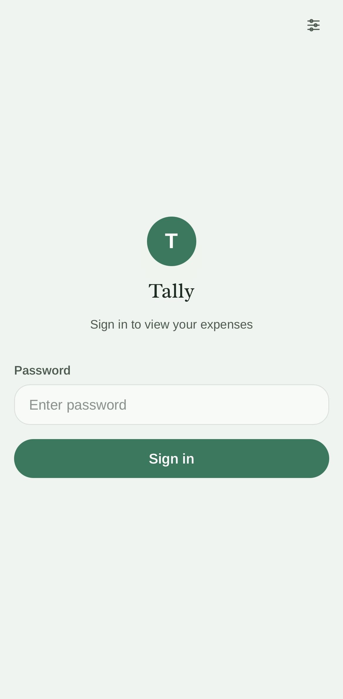
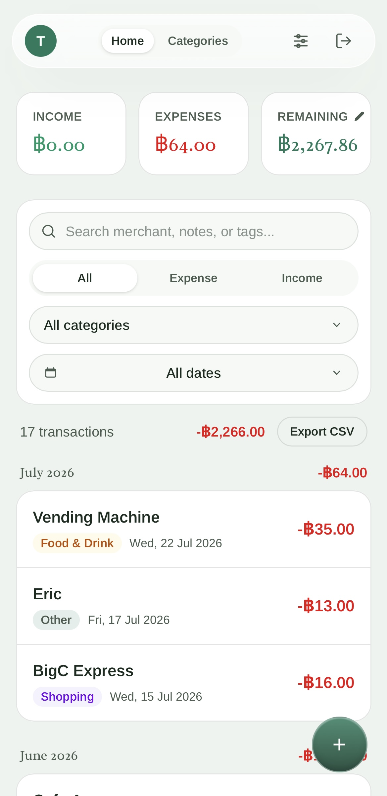
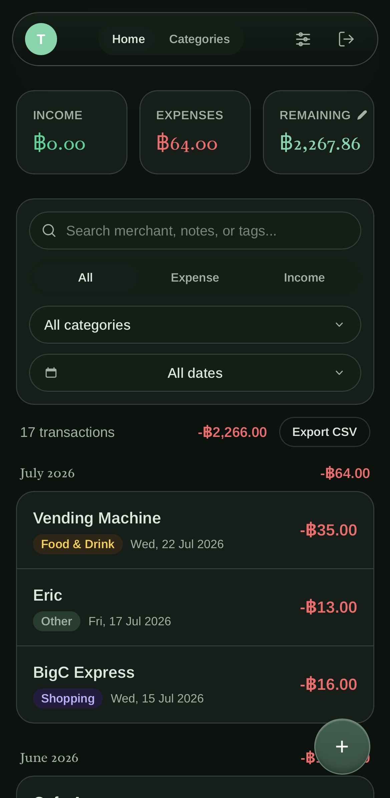
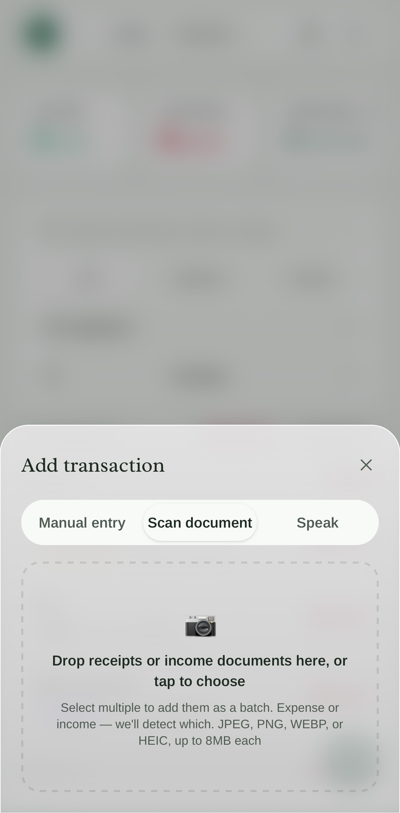
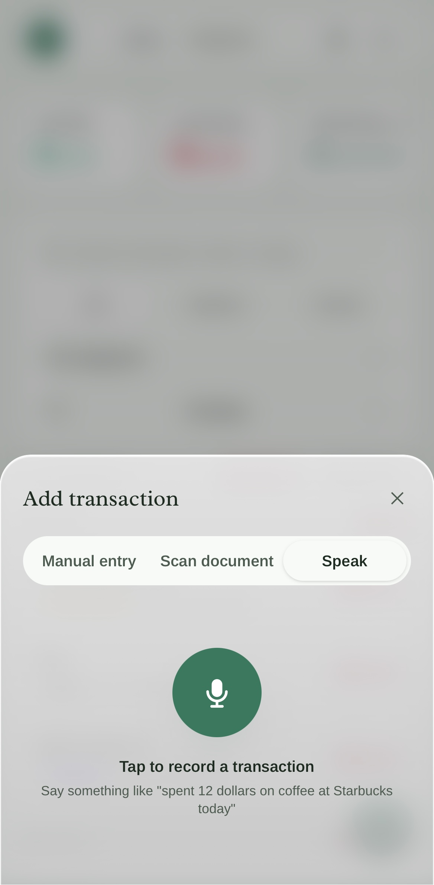
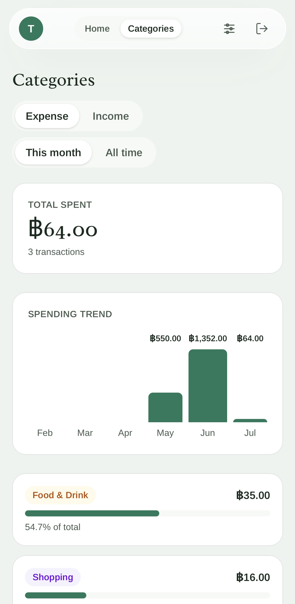
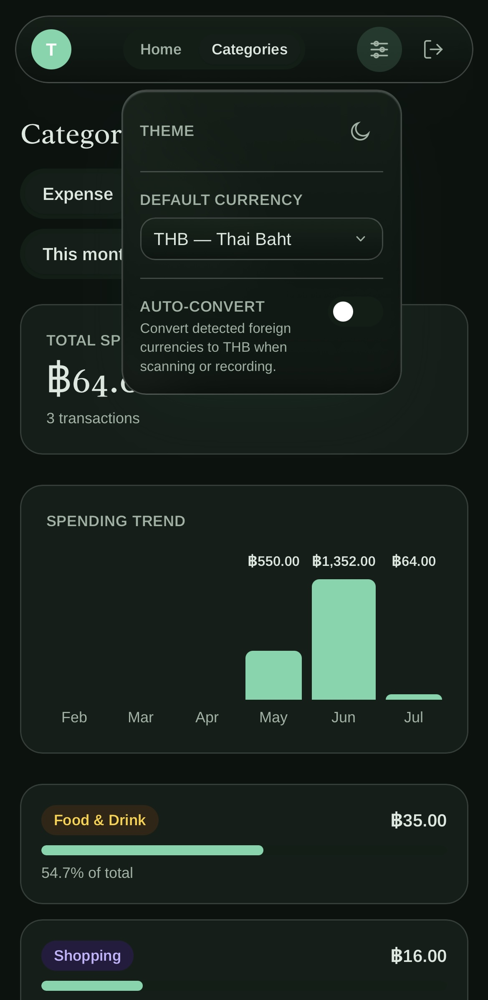

# Tally — Personal Expense Tracker

A private, personal expense tracker. Add expenses manually or snap a photo of a
receipt and let Gemini's vision API read the merchant, total, date, and
category for you to review before saving.

## Deploy

[](https://vercel.com/new/clone?repository-url=https%3A%2F%2Fgithub.com%2Fkittinatger%2Ftally-kittinat-gerdsri&env=POSTGRES_URL,GEMINI_API_KEY,SESSION_SECRET&envDescription=Required%20environment%20variables%20for%20Tally&envLink=https%3A%2F%2Fgithub.com%2Fkittinatger%2Ftally-kittinat-gerdsri%2Fblob%2Fmaster%2F.env.local.example)

Or follow the [detailed step-by-step Vercel deployment guide](DEPLOYMENT_VERCEL.md) (no technical experience needed).

## Features

- **Manual entry & receipt scanning** — enter expenses/income manually (date, amount, merchant, category, notes) or snap a photo; [Google Gemini](https://ai.google.dev/) extracts the fields and pre-fills the form for you to review.
- **Voice-to-expense** — tap the mic and say something like "spent 12 dollars on coffee at Starbucks today"; Gemini transcribes and extracts the fields for you to review before saving.
- **Bulk scanning** — drop multiple receipt photos at once; they queue up for review and batch-save.
- **Receipt storage** — original scanned images are saved and viewable from the transaction detail.
- **Search & filter** — search by merchant/notes/tags; filter by type (income/expense), category, tags, or date range.
- **Free-form tags** — label transactions with custom tags for cross-cutting groupings.
- **Income tracking** — separate income and expense transaction types with distinct category lists.
- **Customizable categories** — rename and recolor expense/income categories to match your workflow.
- **Spending trends** — see a 6-month trend chart and category breakdown right on the Dashboard.
- **CSV export** — download filtered transactions in CSV format.
- **Remaining balance** — live-updating balance that auto-calculates from a starting point and all logged transactions.
- **Currency selection** — pick your default currency in Settings; formatting updates everywhere immediately.
- **Automatic currency conversion** — optional toggle in settings; when scanning receipts or recording voice memos in a different currency, the detected amount is converted to your default currency (via [Frankfurter](https://frankfurter.app), a free ECB-rate API) before you review it.
- **Multi-user accounts** — anyone can sign up with their own username and password; each account's expenses, categories, and balance are fully private and isolated from every other account on the same deployment, via signed, httpOnly session cookies.
- **Account management** — change your username or password any time from Settings (both require re-entering your current password to confirm).
- **Liquid-glass UI** — clean, modern design built for quick entry on a phone and full desktop use.
- **Postgres storage** — works out of the box with [Vercel's Neon database](https://vercel.com/docs/storage/vercel-postgres) (free tier available).

## Screenshots

<table>
<tr>
<td></td>
<td></td>
<td></td>
</tr>
<tr>
<td></td>
<td></td>
<td></td>
</tr>
<tr>
<td></td>
</tr>
</table>

## Tech stack

- [Next.js](https://nextjs.org) (App Router) + TypeScript
- [Tailwind CSS](https://tailwindcss.com) v4
- [`@vercel/postgres`](https://vercel.com/docs/storage/vercel-postgres) for storage
- [`@google/genai`](https://www.npmjs.com/package/@google/genai) for receipt vision extraction (Gemini)

## Local development

### 1. Install dependencies

```bash
npm install
```

### 2. Configure environment variables

Copy the example file:

```bash
cp .env.local.example .env.local
```

Then fill in `.env.local`:

| Variable | Required | Notes |
| --- | --- | --- |
| `POSTGRES_URL` | Yes | Connection string for your Postgres database. If you're using Vercel Postgres, run `vercel env pull .env.local` after creating the database (see below) instead of setting it by hand. |
| `GEMINI_API_KEY` | Yes | Free key from [Google AI Studio](https://aistudio.google.com/apikey). Used only for receipt scanning; manual entry works without it. |
| `SESSION_SECRET` | Yes | A random secret that keeps your login session secure. Think of it like a security key that scrambles your session cookie so no one can forge a fake login. Generate one by copying and pasting this into your terminal: `node -e "console.log(require('crypto').randomBytes(32).toString('hex'))"` — it will print out a long random string (like `e7b4d9fccc1ade2ae...`). Paste that string as the value for `SESSION_SECRET`. **Important**: Use a different random string for production (on Vercel) than for local development. |
| `ADMIN_USERNAME` / `ADMIN_BOOTSTRAP_PASSWORD` | No | Only needed once, on the very first deploy of an instance that already has data from before multi-user accounts existed — creates an admin account and assigns that existing data to it. Leave unset on a brand-new install; everyone just signs up at `/register` instead. Remove both after confirming the admin account works. |

### 3. Get a Postgres database

Easiest option — use a free [Neon Postgres database](https://neon.tech) via Vercel:

1. Push this repo to GitHub (see below) and import it into a new [Vercel](https://vercel.com) project.
2. In the Vercel project, go to **Storage → Create Database → Neon**, and connect it to the project.
3. Locally, run `npx vercel link` once to link this folder to the Vercel project, then `npx vercel env pull .env.local` to pull `POSTGRES_URL` (and any other env vars you've set in Vercel) into your local `.env.local`.

**Note**: Vercel's free Postgres tier now uses Neon. It works exactly the same way — just a different provider.

The `expenses` table is created automatically on first use — no manual migration step needed.

### 4. Run it

```bash
npm run dev
```

Open [http://localhost:3000](http://localhost:3000). You'll be redirected to `/login` first.

## Deploying privately

For the full step-by-step walkthrough (forking, Vercel, database, environment variables), see the [Vercel deployment guide](DEPLOYMENT_VERCEL.md).

Push the repo to a **private** GitHub repo instead of forking publicly if you'd rather keep your copy invisible to others. Everything else in the guide is the same. You can also enable [Vercel's built-in Deployment Protection](https://vercel.com/docs/deployment-protection) for an extra layer.

**Alternative hosts**: Railway.app and Fly.io also work (same environment variables, different UI); Docker self-hosting is possible but not documented here yet.

## Known limitations

- **No account deletion or password reset (forgot-password) flow yet**: you can change your username/password from Settings while logged in, but there's no way to delete an account or recover access if you forget your password.
- **Requires Gemini API key**: Receipt scanning and voice transcription require a free API key from [Google AI Studio](https://aistudio.google.com/apikey). Manual entry and CSV export work without it.
- **Requires Postgres database**: The app stores all data in Postgres (not SQLite). Free tier available via Vercel (uses Neon), or [Railway](https://railway.app).

## Security notes

- **API authentication**: All API routes (`/api/*`) require a valid session token and are protected by middleware. Unauthenticated requests return `401 Unauthorized`.
- **Multi-user accounts, fully isolated**: Anyone can create an account at `/register` (username + password, no email). Every account's expenses, categories, and balance are scoped to that account only — no other account can see or modify them.
- **Password storage**: Passwords are hashed with scrypt (a slow, salted hashing algorithm) before being stored — the plaintext password is never saved anywhere.
- **Session security**: Sessions are signed with HMAC-SHA256 (a mathematical lock that proves no one tampered with your login badge) using `SESSION_SECRET`, stored in httpOnly cookies (locked away where hackers can't access them), and expire after 30 days. Session cookies are marked `Secure` (only works on encrypted websites) and `SameSite=Lax` (protects against tricks) in production.
- **HTTPS required**: Always deploy on HTTPS in production. Session cookies include the `Secure` flag and will not work over plain HTTP.
- **Environment variables**: Store `SESSION_SECRET` (and `ADMIN_BOOTSTRAP_PASSWORD`, if used) securely in your hosting platform's environment variable settings (Vercel, Railway, etc.), not in code. Never commit `.env.local`.
- **Rotate secrets**: If you suspect `SESSION_SECRET` has leaked, rotate it immediately — this invalidates all existing sessions for every account, logging everyone out.

## Developed by

[Kittinat Gerdsri](https://kittinatger.github.io/kittinat-gerdsri/)

Tally is a personal project designed to make expense tracking simple, private, and self-hosted.
